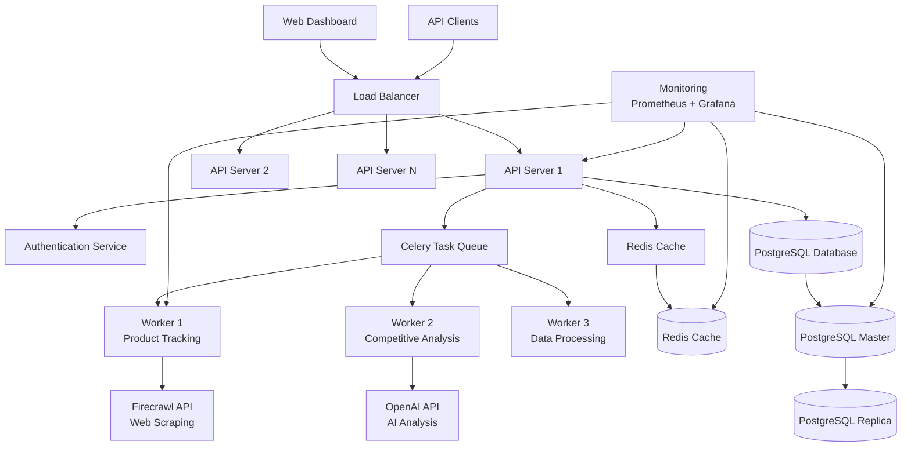
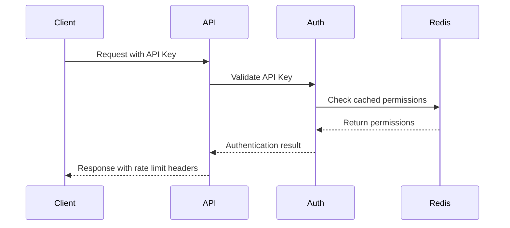
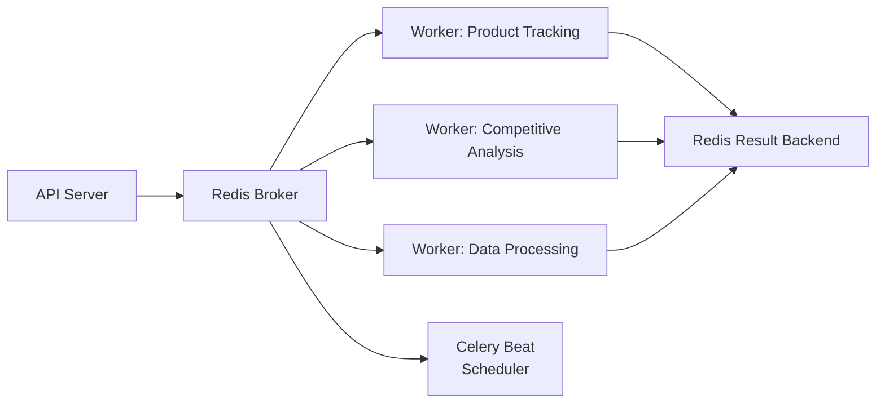
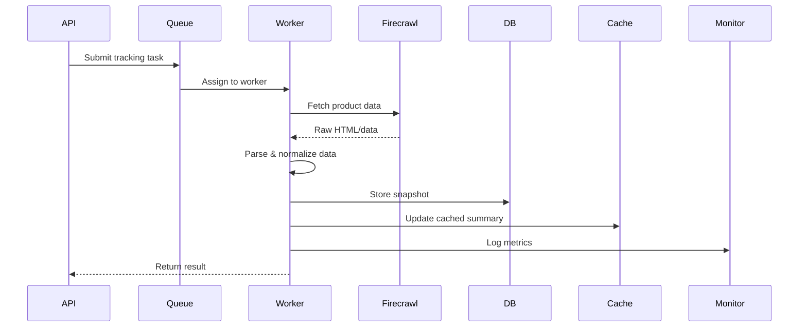
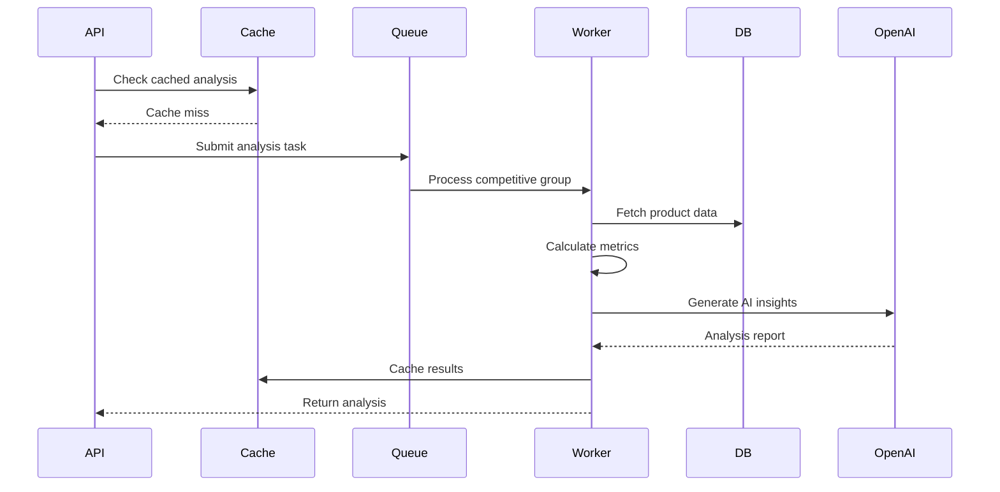
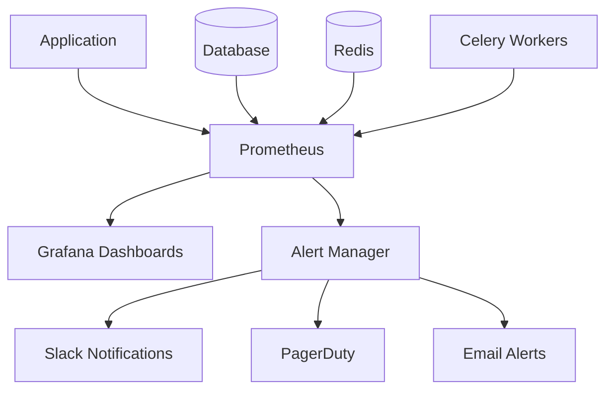
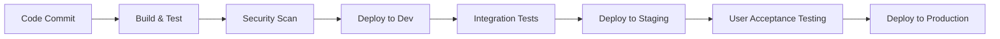

# Amazon Insights System Architecture

## Overview

Amazon Insights is a comprehensive e-commerce intelligence platform that provides real-time product monitoring and competitive analysis capabilities. The system is designed using microservices architecture with horizontal scalability and high availability in mind.

## System Architecture Diagram



## Core Components

### 1. API Gateway & Load Balancer

#### Responsibilities
- Request routing and load distribution
- Rate limiting and throttling
- SSL termination
- Health checks and failover

#### Technologies
- **Load Balancer**: HAProxy or NGINX
- **API Gateway**: FastAPI with middleware stack
- **Rate Limiting**: Redis-based sliding window
- **SSL**: Let's Encrypt certificates

#### Scalability Considerations
- Horizontal scaling with multiple API instances
- Session-less architecture for stateless scaling
- Auto-scaling based on CPU and memory metrics

### 2. Authentication & Authorization

#### Authentication Flow


#### Security Features
- **API Key Authentication**: Bearer token authentication
- **Rate Limiting**: Per-key rate limiting with different tiers
- **Permission System**: Role-based access control (RBAC)
- **Request Validation**: Pydantic schema validation
- **Security Headers**: CORS, CSP, HSTS implementation

### 3. Caching Strategy

#### Multi-Layer Caching
- **L1 Cache**: Application-level in-memory cache (TTL: 5 minutes)
- **L2 Cache**: Redis distributed cache (TTL: 1-48 hours)
- **L3 Cache**: Database query result cache (TTL: varies)

#### Cache Patterns
- **Cache-Aside**: For frequently accessed data
- **Write-Through**: For critical data consistency
- **Write-Behind**: For high-throughput operations

#### Cache Keys Strategy
```
product:{asin}:summary          (TTL: 24h)
product:{asin}:history:{limit}  (TTL: 48h)
competitive:{group_id}:analysis (TTL: 1h)
system:status                   (TTL: 5m)
alerts:recent:{hours}           (TTL: 1h)
```

### 4. Task Queue & Background Processing

#### Celery Architecture


#### Task Types
- **Immediate Tasks**: Real-time product tracking
- **Scheduled Tasks**: Daily monitoring jobs
- **Batch Tasks**: Competitive analysis processing
- **Maintenance Tasks**: Data cleanup and optimization

#### Queue Configuration
```python
# Queue priorities and routing
CELERY_ROUTES = {
    'tasks.track_single_product': {'queue': 'high_priority'},
    'tasks.track_all_products': {'queue': 'normal_priority'},
    'tasks.competitive_analysis': {'queue': 'analysis_priority'},
    'tasks.cleanup_tasks': {'queue': 'low_priority'},
}
```

### 5. Database Architecture

#### PostgreSQL Design
- **Master-Slave Replication**: Read/write separation
- **Partitioning**: Time-based partitioning for historical data
- **Indexing Strategy**: Optimized indexes for query patterns
- **Connection Pooling**: PgBouncer for connection management

#### Data Partitioning Strategy
```sql
-- Partition by month for historical data
CREATE TABLE product_snapshots_2024_01 PARTITION OF product_snapshots
FOR VALUES FROM ('2024-01-01') TO ('2024-02-01');
```

#### Backup & Recovery
- **Automated Backups**: Daily full + hourly incremental
- **Point-in-Time Recovery**: WAL archiving
- **Cross-Region Replication**: Disaster recovery setup

## Data Flow Architecture

### 1. Product Tracking Flow



### 2. Competitive Analysis Flow



## Scalability Design

### Horizontal Scaling Strategy

#### Auto-Scaling Metrics
- **API Servers**: CPU usage > 70%, Response time > 500ms
- **Workers**: Queue depth > 100 tasks, Memory usage > 80%
- **Database**: Connection count > 80%, Query response time > 100ms

#### Scaling Limits
- **API Servers**: 2-10 instances
- **Workers**: 1-20 instances per queue type
- **Database**: Master + up to 5 read replicas

### Performance Targets (SLA/SLO)

#### Service Level Objectives
- **API Response Time**: 95% < 200ms, 99% < 500ms
- **System Availability**: 99.9% uptime
- **Data Freshness**: Product data < 24h old
- **Analysis Completion**: Competitive analysis < 2 minutes

#### Service Level Agreements
- **API Availability**: 99.5% monthly uptime
- **Data Accuracy**: 99.9% data parsing success rate
- **Support Response**: < 4 hours for critical issues

## Security Architecture

### Authentication & Authorization
- **API Key Management**: Secure key generation and rotation
- **Permission Matrix**: Granular access control per endpoint
- **Audit Logging**: All API access logged with user context

### Data Protection
- **Encryption at Rest**: Database encryption with AES-256
- **Encryption in Transit**: TLS 1.3 for all communications
- **Secrets Management**: HashiCorp Vault or AWS Secrets Manager

### Network Security
- **VPC Architecture**: Private subnets for database and workers
- **Security Groups**: Principle of least privilege
- **DDoS Protection**: CloudFlare or AWS Shield

## Monitoring & Observability

### Metrics Collection


### Key Metrics
- **Business Metrics**: Products tracked, analysis completed, API usage
- **System Metrics**: Response times, error rates, queue depths
- **Infrastructure Metrics**: CPU, memory, disk usage, network I/O

### Alerting Rules
- **Critical**: API down, database unavailable, high error rate
- **Warning**: High response time, queue backlog, resource usage
- **Info**: Daily reports, capacity planning metrics

### Logging Strategy
- **Structured Logging**: JSON format with consistent fields
- **Log Aggregation**: ELK stack or CloudWatch Logs
- **Log Retention**: 30 days for application logs, 90 days for audit logs

## Deployment Architecture

### Environment Strategy
- **Development**: Single-instance deployment with SQLite
- **Staging**: Multi-instance with PostgreSQL replica
- **Production**: Full high-availability setup

### CI/CD Pipeline


### Blue-Green Deployment
- **Zero-Downtime Deployment**: Blue-green deployment strategy
- **Database Migrations**: Forward-compatible migrations
- **Rollback Strategy**: Automated rollback on health check failure

## Disaster Recovery

### Backup Strategy
- **Database Backups**: Daily full + hourly incremental
- **Configuration Backups**: Infrastructure as Code (Terraform)
- **Application Backups**: Docker images in registry

### Recovery Procedures
- **RTO (Recovery Time Objective)**: < 4 hours
- **RPO (Recovery Point Objective)**: < 1 hour
- **Failover Process**: Automated failover for database, manual for application

### Business Continuity
- **Multi-Region Setup**: Primary and disaster recovery regions
- **Data Replication**: Cross-region database replication
- **Monitoring**: Continuous health checks and automated alerts

## Technology Stack Summary

### Backend Technologies
- **Runtime**: Python 3.9+
- **Web Framework**: FastAPI
- **Task Queue**: Celery with Redis broker
- **Database**: PostgreSQL 14+ with replication
- **Caching**: Redis 6+
- **Authentication**: JWT with Redis session store

### Infrastructure Technologies
- **Containerization**: Docker + Docker Compose
- **Orchestration**: Kubernetes (production)
- **Load Balancer**: NGINX or HAProxy
- **Monitoring**: Prometheus + Grafana
- **Logging**: ELK Stack or similar

### External Dependencies
- **Web Scraping**: Firecrawl API
- **AI Analysis**: OpenAI GPT-4 API
- **Notifications**: Slack, Email, PagerDuty
- **DNS**: CloudFlare or AWS Route 53

## Future Architecture Considerations

### Microservices Evolution
- **Service Decomposition**: Split into domain-specific services
- **API Gateway**: Centralized API management
- **Service Mesh**: Istio for service-to-service communication

### Data Pipeline Enhancement
- **Stream Processing**: Apache Kafka for real-time data streams
- **Data Warehouse**: Analytics database for historical analysis
- **Machine Learning**: ML pipeline for predictive analytics

### Global Expansion
- **Multi-Region Deployment**: Global presence for low latency
- **CDN Integration**: Static asset delivery optimization
- **Compliance**: GDPR, CCPA compliance for global markets