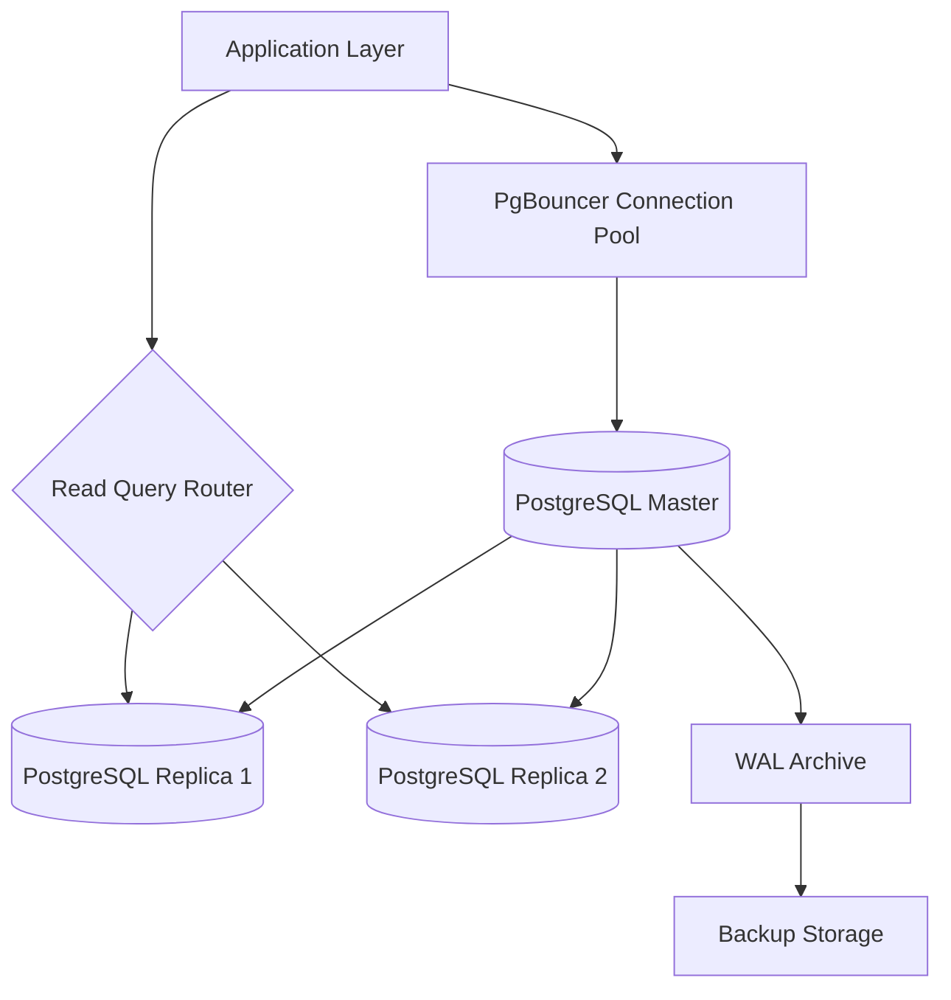
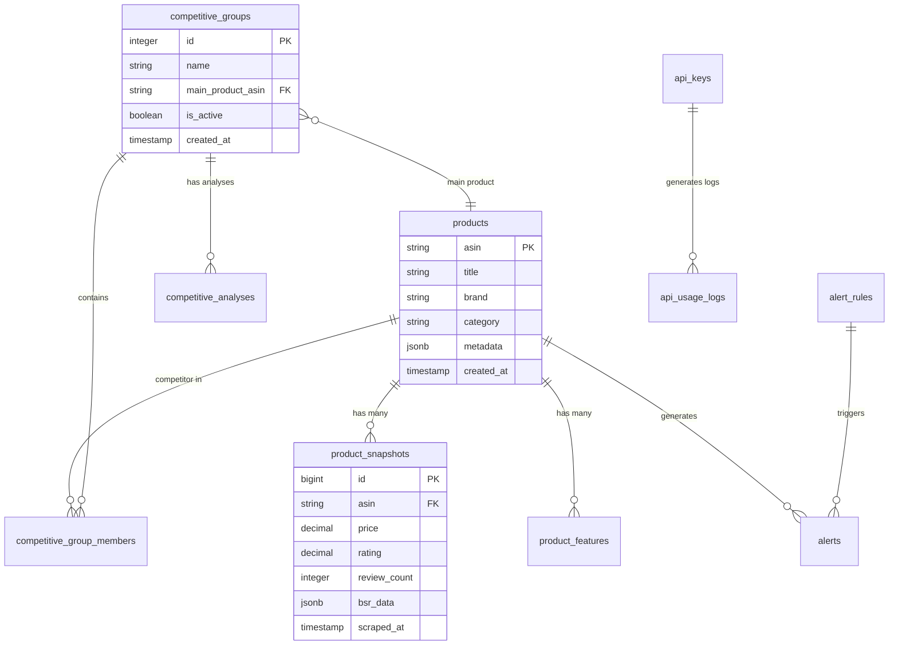

# Amazon Insights Database Design

## Overview

This document outlines the database design for Amazon Insights, including schema design, indexing strategy, partitioning, and performance considerations. The system uses PostgreSQL as the primary database with master-slave replication for high availability and read scalability.

## Database Architecture

### PostgreSQL Setup
- **Version**: PostgreSQL 14+
- **Configuration**: Master-slave replication
- **Connection Pooling**: PgBouncer for connection management
- **Backup Strategy**: Continuous WAL archiving with point-in-time recovery

### High-Level Architecture


## Core Schema Design

### 1. Product Management Tables

#### products
```sql
CREATE TABLE products (
    asin VARCHAR(10) PRIMARY KEY,
    title VARCHAR(500) NOT NULL,
    brand VARCHAR(100),
    category VARCHAR(200),
    manufacturer VARCHAR(100),
    model VARCHAR(100),
    dimensions JSONB,
    weight DECIMAL(8,2),
    first_tracked_at TIMESTAMP WITH TIME ZONE NOT NULL DEFAULT NOW(),
    last_updated_at TIMESTAMP WITH TIME ZONE NOT NULL DEFAULT NOW(),
    is_active BOOLEAN NOT NULL DEFAULT true,
    tracking_frequency INTERVAL DEFAULT '24 hours',
    metadata JSONB DEFAULT '{}',
    created_at TIMESTAMP WITH TIME ZONE NOT NULL DEFAULT NOW(),
    updated_at TIMESTAMP WITH TIME ZONE NOT NULL DEFAULT NOW()
);

-- Indexes
CREATE INDEX idx_products_brand ON products(brand);
CREATE INDEX idx_products_category ON products(category);
CREATE INDEX idx_products_last_updated ON products(last_updated_at);
CREATE INDEX idx_products_active ON products(is_active);
CREATE INDEX idx_products_metadata ON products USING GIN(metadata);
```

#### product_snapshots (Partitioned Table)
```sql
-- Parent table
CREATE TABLE product_snapshots (
    id BIGSERIAL NOT NULL,
    asin VARCHAR(10) NOT NULL,
    title VARCHAR(500),
    price DECIMAL(10,2),
    buybox_price DECIMAL(10,2),
    rating DECIMAL(3,2) CHECK (rating >= 0 AND rating <= 5),
    review_count INTEGER DEFAULT 0,
    bsr_data JSONB DEFAULT '{}',
    availability_status VARCHAR(50),
    bullet_points TEXT[],
    product_description TEXT,
    images JSONB DEFAULT '[]',
    variations JSONB DEFAULT '{}',
    scraped_at TIMESTAMP WITH TIME ZONE NOT NULL DEFAULT NOW(),
    raw_data JSONB,
    processing_status VARCHAR(20) DEFAULT 'processed',
    created_at TIMESTAMP WITH TIME ZONE NOT NULL DEFAULT NOW(),
    
    PRIMARY KEY (id, scraped_at),
    FOREIGN KEY (asin) REFERENCES products(asin) ON DELETE CASCADE
) PARTITION BY RANGE (scraped_at);

-- Monthly partitions
CREATE TABLE product_snapshots_2024_01 PARTITION OF product_snapshots
FOR VALUES FROM ('2024-01-01') TO ('2024-02-01');

CREATE TABLE product_snapshots_2024_02 PARTITION OF product_snapshots
FOR VALUES FROM ('2024-02-01') TO ('2024-03-01');

-- Indexes on partitioned table
CREATE INDEX idx_snapshots_asin_time ON product_snapshots(asin, scraped_at DESC);
CREATE INDEX idx_snapshots_price ON product_snapshots(price) WHERE price IS NOT NULL;
CREATE INDEX idx_snapshots_rating ON product_snapshots(rating) WHERE rating IS NOT NULL;
CREATE INDEX idx_snapshots_status ON product_snapshots(processing_status);
CREATE INDEX idx_snapshots_bsr ON product_snapshots USING GIN(bsr_data);
```

#### product_features
```sql
CREATE TABLE product_features (
    id BIGSERIAL PRIMARY KEY,
    asin VARCHAR(10) NOT NULL,
    feature_category VARCHAR(50) NOT NULL,
    feature_name VARCHAR(100) NOT NULL,
    feature_value TEXT,
    confidence_score DECIMAL(3,2) DEFAULT 1.0,
    extracted_at TIMESTAMP WITH TIME ZONE NOT NULL DEFAULT NOW(),
    extraction_method VARCHAR(20) DEFAULT 'parser', -- parser, ai, manual
    is_verified BOOLEAN DEFAULT false,
    created_at TIMESTAMP WITH TIME ZONE NOT NULL DEFAULT NOW(),
    
    FOREIGN KEY (asin) REFERENCES products(asin) ON DELETE CASCADE,
    UNIQUE(asin, feature_category, feature_name)
);

-- Indexes
CREATE INDEX idx_features_asin ON product_features(asin);
CREATE INDEX idx_features_category ON product_features(feature_category);
CREATE INDEX idx_features_name ON product_features(feature_name);
CREATE INDEX idx_features_extracted_at ON product_features(extracted_at);
```

### 2. Competitive Analysis Tables

#### competitive_groups
```sql
CREATE TABLE competitive_groups (
    id SERIAL PRIMARY KEY,
    name VARCHAR(200) NOT NULL,
    description TEXT,
    main_product_asin VARCHAR(10) NOT NULL,
    industry_category VARCHAR(100),
    analysis_frequency INTERVAL DEFAULT '24 hours',
    auto_update BOOLEAN DEFAULT true,
    is_active BOOLEAN DEFAULT true,
    created_by VARCHAR(50), -- API key identifier
    settings JSONB DEFAULT '{}',
    created_at TIMESTAMP WITH TIME ZONE NOT NULL DEFAULT NOW(),
    updated_at TIMESTAMP WITH TIME ZONE NOT NULL DEFAULT NOW(),
    
    FOREIGN KEY (main_product_asin) REFERENCES products(asin)
);

-- Indexes
CREATE INDEX idx_competitive_groups_main_asin ON competitive_groups(main_product_asin);
CREATE INDEX idx_competitive_groups_active ON competitive_groups(is_active);
CREATE INDEX idx_competitive_groups_created_by ON competitive_groups(created_by);
```

#### competitive_group_members
```sql
CREATE TABLE competitive_group_members (
    id SERIAL PRIMARY KEY,
    group_id INTEGER NOT NULL,
    competitor_asin VARCHAR(10) NOT NULL,
    competitor_name VARCHAR(200),
    priority INTEGER DEFAULT 1,
    is_active BOOLEAN DEFAULT true,
    added_at TIMESTAMP WITH TIME ZONE NOT NULL DEFAULT NOW(),
    added_by VARCHAR(50),
    
    FOREIGN KEY (group_id) REFERENCES competitive_groups(id) ON DELETE CASCADE,
    FOREIGN KEY (competitor_asin) REFERENCES products(asin),
    UNIQUE(group_id, competitor_asin)
);

-- Indexes
CREATE INDEX idx_group_members_group_id ON competitive_group_members(group_id);
CREATE INDEX idx_group_members_asin ON competitive_group_members(competitor_asin);
CREATE INDEX idx_group_members_active ON competitive_group_members(is_active);
```

#### competitive_analyses (Partitioned Table)
```sql
-- Parent table
CREATE TABLE competitive_analyses (
    id BIGSERIAL NOT NULL,
    group_id INTEGER NOT NULL,
    analysis_type VARCHAR(50) DEFAULT 'standard', -- basic, standard, comprehensive
    status VARCHAR(20) DEFAULT 'pending', -- pending, processing, completed, failed
    competitive_scores JSONB DEFAULT '{}',
    position_summary JSONB DEFAULT '{}',
    market_insights JSONB DEFAULT '{}',
    price_analysis JSONB DEFAULT '{}',
    rating_analysis JSONB DEFAULT '{}',
    bsr_analysis JSONB DEFAULT '{}',
    feature_analysis JSONB DEFAULT '{}',
    llm_report JSONB,
    execution_time_seconds DECIMAL(8,2),
    data_freshness_hours INTEGER,
    error_message TEXT,
    created_at TIMESTAMP WITH TIME ZONE NOT NULL DEFAULT NOW(),
    completed_at TIMESTAMP WITH TIME ZONE,
    
    PRIMARY KEY (id, created_at),
    FOREIGN KEY (group_id) REFERENCES competitive_groups(id) ON DELETE CASCADE
) PARTITION BY RANGE (created_at);

-- Monthly partitions for analyses
CREATE TABLE competitive_analyses_2024_01 PARTITION OF competitive_analyses
FOR VALUES FROM ('2024-01-01') TO ('2024-02-01');

-- Indexes
CREATE INDEX idx_analyses_group_created ON competitive_analyses(group_id, created_at DESC);
CREATE INDEX idx_analyses_status ON competitive_analyses(status);
CREATE INDEX idx_analyses_type ON competitive_analyses(analysis_type);
```

### 3. Alert System Tables

#### alert_rules
```sql
CREATE TABLE alert_rules (
    id SERIAL PRIMARY KEY,
    name VARCHAR(200) NOT NULL,
    rule_type VARCHAR(50) NOT NULL, -- price_change, rating_change, rank_change, stock_change
    target_type VARCHAR(20) NOT NULL, -- product, group
    target_id VARCHAR(20) NOT NULL, -- asin or group_id
    conditions JSONB NOT NULL, -- threshold conditions
    severity VARCHAR(10) DEFAULT 'medium', -- low, medium, high, critical
    is_active BOOLEAN DEFAULT true,
    notification_channels JSONB DEFAULT '[]', -- email, slack, webhook
    created_by VARCHAR(50),
    last_triggered_at TIMESTAMP WITH TIME ZONE,
    trigger_count INTEGER DEFAULT 0,
    created_at TIMESTAMP WITH TIME ZONE NOT NULL DEFAULT NOW(),
    updated_at TIMESTAMP WITH TIME ZONE NOT NULL DEFAULT NOW()
);

-- Indexes
CREATE INDEX idx_alert_rules_type ON alert_rules(rule_type);
CREATE INDEX idx_alert_rules_target ON alert_rules(target_type, target_id);
CREATE INDEX idx_alert_rules_active ON alert_rules(is_active);
```

#### alerts (Partitioned Table)
```sql
-- Parent table
CREATE TABLE alerts (
    id BIGSERIAL NOT NULL,
    rule_id INTEGER,
    alert_type VARCHAR(50) NOT NULL,
    target_asin VARCHAR(10),
    severity VARCHAR(10) NOT NULL,
    title VARCHAR(200) NOT NULL,
    message TEXT NOT NULL,
    old_value JSONB,
    new_value JSONB,
    change_percentage DECIMAL(8,2),
    metadata JSONB DEFAULT '{}',
    is_read BOOLEAN DEFAULT false,
    is_resolved BOOLEAN DEFAULT false,
    resolved_at TIMESTAMP WITH TIME ZONE,
    triggered_at TIMESTAMP WITH TIME ZONE NOT NULL DEFAULT NOW(),
    
    PRIMARY KEY (id, triggered_at),
    FOREIGN KEY (rule_id) REFERENCES alert_rules(id),
    FOREIGN KEY (target_asin) REFERENCES products(asin)
) PARTITION BY RANGE (triggered_at);

-- Monthly partitions for alerts
CREATE TABLE alerts_2024_01 PARTITION OF alerts
FOR VALUES FROM ('2024-01-01') TO ('2024-02-01');

-- Indexes
CREATE INDEX idx_alerts_asin_time ON alerts(target_asin, triggered_at DESC);
CREATE INDEX idx_alerts_severity ON alerts(severity);
CREATE INDEX idx_alerts_unread ON alerts(is_read) WHERE is_read = false;
CREATE INDEX idx_alerts_type ON alerts(alert_type);
```

### 4. User Management & Authentication

#### api_keys
```sql
CREATE TABLE api_keys (
    id SERIAL PRIMARY KEY,
    key_id VARCHAR(50) UNIQUE NOT NULL, -- pk_, sk_, ak_
    key_hash VARCHAR(64) NOT NULL, -- SHA-256 hash
    name VARCHAR(100),
    key_type VARCHAR(10) NOT NULL, -- public, secret, admin
    permissions JSONB NOT NULL DEFAULT '[]',
    rate_limit_tier VARCHAR(20) DEFAULT 'free', -- free, pro, enterprise
    is_active BOOLEAN DEFAULT true,
    last_used_at TIMESTAMP WITH TIME ZONE,
    usage_count BIGINT DEFAULT 0,
    expires_at TIMESTAMP WITH TIME ZONE,
    created_by VARCHAR(50),
    metadata JSONB DEFAULT '{}',
    created_at TIMESTAMP WITH TIME ZONE NOT NULL DEFAULT NOW(),
    updated_at TIMESTAMP WITH TIME ZONE NOT NULL DEFAULT NOW()
);

-- Indexes
CREATE UNIQUE INDEX idx_api_keys_key_id ON api_keys(key_id);
CREATE INDEX idx_api_keys_hash ON api_keys(key_hash);
CREATE INDEX idx_api_keys_active ON api_keys(is_active);
CREATE INDEX idx_api_keys_tier ON api_keys(rate_limit_tier);
CREATE INDEX idx_api_keys_expires ON api_keys(expires_at) WHERE expires_at IS NOT NULL;
```

#### api_usage_logs (Partitioned Table)
```sql
-- Parent table
CREATE TABLE api_usage_logs (
    id BIGSERIAL NOT NULL,
    key_id VARCHAR(50) NOT NULL,
    endpoint VARCHAR(200) NOT NULL,
    method VARCHAR(10) NOT NULL,
    status_code INTEGER NOT NULL,
    response_time_ms INTEGER,
    request_size_bytes INTEGER,
    response_size_bytes INTEGER,
    ip_address INET,
    user_agent TEXT,
    error_message TEXT,
    timestamp TIMESTAMP WITH TIME ZONE NOT NULL DEFAULT NOW(),
    
    PRIMARY KEY (id, timestamp),
    FOREIGN KEY (key_id) REFERENCES api_keys(key_id) ON DELETE CASCADE
) PARTITION BY RANGE (timestamp);

-- Daily partitions for usage logs
CREATE TABLE api_usage_logs_2024_01_15 PARTITION OF api_usage_logs
FOR VALUES FROM ('2024-01-15') TO ('2024-01-16');

-- Indexes
CREATE INDEX idx_usage_logs_key_time ON api_usage_logs(key_id, timestamp DESC);
CREATE INDEX idx_usage_logs_endpoint ON api_usage_logs(endpoint);
CREATE INDEX idx_usage_logs_status ON api_usage_logs(status_code);
CREATE INDEX idx_usage_logs_ip ON api_usage_logs(ip_address);
```

### 5. Task Management

#### task_executions
```sql
CREATE TABLE task_executions (
    id BIGSERIAL PRIMARY KEY,
    task_id VARCHAR(100) UNIQUE NOT NULL, -- Celery task ID
    task_name VARCHAR(100) NOT NULL,
    task_args JSONB DEFAULT '[]',
    task_kwargs JSONB DEFAULT '{}',
    status VARCHAR(20) DEFAULT 'pending', -- pending, started, success, failure, retry
    result JSONB,
    error_message TEXT,
    retry_count INTEGER DEFAULT 0,
    max_retries INTEGER DEFAULT 3,
    execution_time_seconds DECIMAL(8,2),
    worker_name VARCHAR(100),
    queue_name VARCHAR(50),
    priority INTEGER DEFAULT 5,
    scheduled_at TIMESTAMP WITH TIME ZONE,
    started_at TIMESTAMP WITH TIME ZONE,
    completed_at TIMESTAMP WITH TIME ZONE,
    created_at TIMESTAMP WITH TIME ZONE NOT NULL DEFAULT NOW()
);

-- Indexes
CREATE UNIQUE INDEX idx_task_executions_task_id ON task_executions(task_id);
CREATE INDEX idx_task_executions_name ON task_executions(task_name);
CREATE INDEX idx_task_executions_status ON task_executions(status);
CREATE INDEX idx_task_executions_queue ON task_executions(queue_name);
CREATE INDEX idx_task_executions_created ON task_executions(created_at);
```

## Indexing Strategy

### Primary Indexes
- **Primary Keys**: All tables have optimized primary keys
- **Foreign Keys**: All foreign key relationships are indexed
- **Unique Constraints**: Enforced with unique indexes

### Performance Indexes
```sql
-- Frequently queried combinations
CREATE INDEX idx_snapshots_asin_price_time ON product_snapshots(asin, price, scraped_at DESC);
CREATE INDEX idx_snapshots_rating_reviews ON product_snapshots(rating, review_count) 
    WHERE rating IS NOT NULL AND review_count > 0;

-- Competitive analysis queries
CREATE INDEX idx_group_members_group_priority ON competitive_group_members(group_id, priority) 
    WHERE is_active = true;

-- Alert system optimization
CREATE INDEX idx_alerts_unresolved_critical ON alerts(triggered_at DESC) 
    WHERE is_resolved = false AND severity = 'critical';

-- API usage analytics
CREATE INDEX idx_usage_logs_endpoint_time ON api_usage_logs(endpoint, timestamp DESC);
CREATE INDEX idx_usage_logs_key_status ON api_usage_logs(key_id, status_code, timestamp);
```

### Partial Indexes
```sql
-- Only index active products
CREATE INDEX idx_products_active_updated ON products(last_updated_at) WHERE is_active = true;

-- Only index failed tasks for monitoring
CREATE INDEX idx_task_failures ON task_executions(created_at, error_message) WHERE status = 'failure';

-- Only index unread critical alerts
CREATE INDEX idx_critical_unread_alerts ON alerts(triggered_at DESC) 
    WHERE is_read = false AND severity = 'critical';
```

## Data Partitioning Strategy

### Time-Based Partitioning
```sql
-- Automated partition creation function
CREATE OR REPLACE FUNCTION create_monthly_partitions(table_name text, start_date date, end_date date)
RETURNS void AS $$
DECLARE
    partition_name text;
    partition_start date;
    partition_end date;
BEGIN
    partition_start := start_date;
    
    WHILE partition_start < end_date LOOP
        partition_end := partition_start + INTERVAL '1 month';
        partition_name := table_name || '_' || to_char(partition_start, 'YYYY_MM');
        
        EXECUTE format('CREATE TABLE IF NOT EXISTS %I PARTITION OF %I 
                       FOR VALUES FROM (%L) TO (%L)',
                       partition_name, table_name, partition_start, partition_end);
        
        partition_start := partition_end;
    END LOOP;
END;
$$ LANGUAGE plpgsql;

-- Create partitions for the next 12 months
SELECT create_monthly_partitions('product_snapshots', '2024-01-01'::date, '2025-01-01'::date);
SELECT create_monthly_partitions('competitive_analyses', '2024-01-01'::date, '2025-01-01'::date);
SELECT create_monthly_partitions('alerts', '2024-01-01'::date, '2025-01-01'::date);
```

### Partition Maintenance
```sql
-- Automated partition pruning (keep 12 months)
CREATE OR REPLACE FUNCTION drop_old_partitions(table_name text, months_to_keep integer)
RETURNS void AS $$
DECLARE
    partition_record record;
    cutoff_date date;
BEGIN
    cutoff_date := date_trunc('month', CURRENT_DATE) - (months_to_keep || ' months')::interval;
    
    FOR partition_record IN
        SELECT schemaname, tablename 
        FROM pg_tables 
        WHERE tablename LIKE table_name || '_%'
        AND tablename < table_name || '_' || to_char(cutoff_date, 'YYYY_MM')
    LOOP
        EXECUTE 'DROP TABLE IF EXISTS ' || partition_record.tablename || ' CASCADE';
    END LOOP;
END;
$$ LANGUAGE plpgsql;
```

## Data Relationships & Constraints

### Entity Relationship Diagram


### Referential Integrity
```sql
-- Cascading deletes for data cleanup
ALTER TABLE product_snapshots 
ADD CONSTRAINT fk_snapshots_asin 
FOREIGN KEY (asin) REFERENCES products(asin) ON DELETE CASCADE;

ALTER TABLE competitive_group_members 
ADD CONSTRAINT fk_members_group 
FOREIGN KEY (group_id) REFERENCES competitive_groups(id) ON DELETE CASCADE;

-- Soft delete for critical data
ALTER TABLE competitive_groups 
ADD CONSTRAINT fk_groups_main_product 
FOREIGN KEY (main_product_asin) REFERENCES products(asin) ON DELETE RESTRICT;
```

## Performance Optimization

### Query Optimization
```sql
-- Materialized view for frequently accessed product summaries
CREATE MATERIALIZED VIEW product_summary_view AS
SELECT 
    p.asin,
    p.title,
    p.brand,
    p.category,
    latest.price AS current_price,
    latest.rating AS current_rating,
    latest.review_count AS current_review_count,
    latest.bsr_data,
    latest.availability_status,
    latest.scraped_at AS last_updated,
    price_stats.min_price_30d,
    price_stats.max_price_30d,
    price_stats.avg_price_30d
FROM products p
LEFT JOIN LATERAL (
    SELECT price, rating, review_count, bsr_data, availability_status, scraped_at
    FROM product_snapshots ps
    WHERE ps.asin = p.asin
    ORDER BY scraped_at DESC
    LIMIT 1
) latest ON true
LEFT JOIN LATERAL (
    SELECT 
        MIN(price) AS min_price_30d,
        MAX(price) AS max_price_30d,
        AVG(price) AS avg_price_30d
    FROM product_snapshots ps
    WHERE ps.asin = p.asin
    AND ps.scraped_at > NOW() - INTERVAL '30 days'
    AND ps.price IS NOT NULL
) price_stats ON true
WHERE p.is_active = true;

-- Index on materialized view
CREATE UNIQUE INDEX idx_product_summary_asin ON product_summary_view(asin);
CREATE INDEX idx_product_summary_brand ON product_summary_view(brand);
CREATE INDEX idx_product_summary_category ON product_summary_view(category);

-- Refresh strategy
CREATE OR REPLACE FUNCTION refresh_product_summaries()
RETURNS void AS $$
BEGIN
    REFRESH MATERIALIZED VIEW CONCURRENTLY product_summary_view;
END;
$$ LANGUAGE plpgsql;
```

### Connection Pooling Configuration
```ini
# PgBouncer configuration
[databases]
amazon_insights = host=localhost port=5432 dbname=amazon_insights

[pgbouncer]
pool_mode = transaction
max_client_conn = 1000
default_pool_size = 25
min_pool_size = 5
reserve_pool_size = 5
reserve_pool_timeout = 3
max_db_connections = 100
max_user_connections = 100
server_reset_query = DISCARD ALL
```

## Backup & Recovery Strategy

### Continuous Archiving (WAL-E)
```bash
# PostgreSQL configuration for WAL archiving
archive_mode = on
archive_command = 'wal-e wal-push %p'
archive_timeout = 60

# Backup schedule
# Full backup: Daily at 2 AM
# Incremental: Every 4 hours
```

### Point-in-Time Recovery
```sql
-- Recovery configuration
SELECT pg_start_backup('daily_backup');
-- File system backup
SELECT pg_stop_backup();

-- Point-in-time recovery example
-- recovery.conf
restore_command = 'wal-e wal-fetch %f %p'
recovery_target_time = '2024-01-15 14:30:00'
```

### Backup Retention Policy
- **Full Backups**: 30 days retention
- **WAL Archives**: 30 days retention
- **Snapshot Backups**: Weekly, 12 weeks retention
- **Cross-region Replication**: Real-time for disaster recovery

## Monitoring & Maintenance

### Database Metrics
```sql
-- Key performance queries
-- Connection usage
SELECT count(*) as active_connections,
       max_conn as max_connections,
       round(count(*) * 100.0 / max_conn, 2) as pct_used
FROM pg_stat_activity, 
     (SELECT setting::int as max_conn FROM pg_settings WHERE name = 'max_connections') mc;

-- Table sizes
SELECT schemaname, tablename,
       pg_size_pretty(pg_total_relation_size(schemaname||'.'||tablename)) as size,
       pg_total_relation_size(schemaname||'.'||tablename) as size_bytes
FROM pg_tables
WHERE schemaname = 'public'
ORDER BY size_bytes DESC;

-- Index usage
SELECT schemaname, tablename, indexname,
       idx_scan as index_scans,
       pg_size_pretty(pg_relation_size(indexrelid)) as index_size
FROM pg_stat_user_indexes
ORDER BY idx_scan DESC;
```

### Maintenance Tasks
```sql
-- Automated maintenance function
CREATE OR REPLACE FUNCTION run_maintenance_tasks()
RETURNS void AS $$
BEGIN
    -- Update table statistics
    ANALYZE;
    
    -- Reindex if needed
    REINDEX INDEX CONCURRENTLY idx_snapshots_asin_time;
    
    -- Refresh materialized views
    REFRESH MATERIALIZED VIEW CONCURRENTLY product_summary_view;
    
    -- Clean up old partitions
    PERFORM drop_old_partitions('product_snapshots', 12);
    PERFORM drop_old_partitions('alerts', 6);
    PERFORM drop_old_partitions('api_usage_logs', 3);
    
    -- Vacuum and analyze large tables
    VACUUM ANALYZE product_snapshots;
    VACUUM ANALYZE competitive_analyses;
END;
$$ LANGUAGE plpgsql;

-- Schedule maintenance (run via cron or pg_cron)
SELECT cron.schedule('database-maintenance', '0 3 * * 0', 'SELECT run_maintenance_tasks();');
```

## Security Considerations

### Data Encryption
- **At Rest**: PostgreSQL transparent data encryption (TDE)
- **In Transit**: SSL/TLS connections required
- **Sensitive Data**: Application-level encryption for API keys

### Access Control
```sql
-- Role-based access control
CREATE ROLE app_readonly;
GRANT SELECT ON ALL TABLES IN SCHEMA public TO app_readonly;

CREATE ROLE app_readwrite;
GRANT SELECT, INSERT, UPDATE ON ALL TABLES IN SCHEMA public TO app_readwrite;
GRANT SELECT, UPDATE ON ALL SEQUENCES IN SCHEMA public TO app_readwrite;

CREATE ROLE app_admin;
GRANT ALL PRIVILEGES ON ALL TABLES IN SCHEMA public TO app_admin;
GRANT ALL PRIVILEGES ON ALL SEQUENCES IN SCHEMA public TO app_admin;

-- Application users
CREATE USER app_user WITH PASSWORD 'secure_password';
GRANT app_readwrite TO app_user;

CREATE USER readonly_user WITH PASSWORD 'secure_password';
GRANT app_readonly TO readonly_user;
```

### Audit Logging
```sql
-- Enable audit logging
shared_preload_libraries = 'pgaudit'
pgaudit.log = 'all'
pgaudit.log_catalog = off
pgaudit.log_parameter = on
pgaudit.log_relation = on
```

This database design provides a robust foundation for the Amazon Insights platform with proper normalization, indexing, partitioning, and scalability considerations. The schema supports both transactional operations and analytical queries while maintaining data integrity and performance.