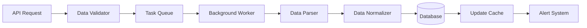

# Amazon Insights Design Decisions

## Overview

This document outlines the key technical and architectural decisions made during the development of Amazon Insights platform, including rationale, trade-offs, and alternative approaches considered.

## Architecture Decisions

### 1. Database Technology Choice

#### Decision: PostgreSQL as Primary Database
**Chosen**: PostgreSQL 14+ with SQLite fallback for development

**Rationale**:
- **ACID Compliance**: Critical for financial and competitive data integrity
- **JSON Support**: Native JSONB support for flexible schema design (BSR data, features)
- **Partitioning**: Built-in table partitioning for time-series data scaling
- **Full-Text Search**: Native search capabilities for product descriptions
- **Replication**: Master-slave replication for read scalability
- **Performance**: Superior performance for complex analytical queries

**Alternatives Considered**:
- **MongoDB**: Rejected due to lack of ACID transactions for financial data
- **MySQL**: Rejected due to inferior JSON support and partitioning capabilities
- **SQLite**: Used as development fallback but insufficient for production scale

**Trade-offs**:
- ✅ **Pros**: Robust, scalable, excellent analytical capabilities
- ❌ **Cons**: More complex setup, higher resource requirements
- 🔄 **Mitigation**: SQLite fallback for development environments

### 2. API Framework Selection

#### Decision: FastAPI with Uvicorn
**Chosen**: FastAPI + Uvicorn + Pydantic for API development

**Rationale**:
- **Performance**: Async/await support for high concurrency
- **Type Safety**: Built-in Pydantic validation and serialization
- **Documentation**: Automatic OpenAPI/Swagger documentation generation
- **Developer Experience**: Excellent IDE support and error messages
- **Standards Compliance**: Full OpenAPI 3.0 specification support

**Alternatives Considered**:
- **Flask**: Rejected due to lack of built-in async support and type hints
- **Django REST**: Rejected due to heavyweight nature for API-only service
- **Express.js**: Rejected to maintain Python ecosystem consistency

**Trade-offs**:
- ✅ **Pros**: Modern, fast, type-safe, excellent DX
- ❌ **Cons**: Relatively newer ecosystem compared to Flask
- 🔄 **Mitigation**: Strong community adoption and stability in recent versions

### 3. Task Queue Architecture

#### Decision: Celery with Redis Broker
**Chosen**: Celery + Redis for background task processing

**Rationale**:
- **Proven Technology**: Battle-tested in production environments
- **Flexibility**: Multiple queue types and priority levels
- **Monitoring**: Built-in monitoring and management tools
- **Scalability**: Horizontal worker scaling capabilities
- **Integration**: Seamless integration with Python ecosystem

**Alternatives Considered**:
- **RQ (Redis Queue)**: Rejected due to limited advanced features
- **Dramatiq**: Rejected due to smaller ecosystem and community
- **Apache Airflow**: Rejected as overkill for simple task scheduling

**Task Queue Design**:
```python
CELERY_ROUTES = {
    'tasks.track_single_product': {'queue': 'high_priority'},
    'tasks.competitive_analysis': {'queue': 'analysis_priority'},
    'tasks.cleanup_tasks': {'queue': 'low_priority'},
}
```

### 4. Caching Strategy

#### Decision: Multi-Layer Redis Caching
**Chosen**: Redis with intelligent caching patterns

**Caching Layers**:
1. **Application Cache**: In-memory for ultra-fast access (5 min TTL)
2. **Distributed Cache**: Redis for shared cache across instances (1-48h TTL)
3. **Database Cache**: Query result caching (varies by data type)

**Cache Key Strategy**:
```
product:{asin}:summary          (24h TTL)
competitive:{group_id}:analysis (1h TTL) 
system:status                   (5m TTL)
```

**Rationale**:
- **Performance**: Sub-millisecond response times for cached data
- **Cost Efficiency**: Reduces external API calls by 90%+
- **Scalability**: Distributed cache supports horizontal scaling
- **Flexibility**: Different TTL strategies for different data types

### 5. Authentication & Authorization

#### Decision: API Key + JWT Hybrid Authentication
**Chosen**: Bearer token authentication with RBAC permissions

**Authentication Flow**:
1. **API Key Validation**: Initial authentication with API keys
2. **Permission Check**: Role-based access control (RBAC)
3. **Rate Limiting**: Per-key rate limiting with tier-based limits
4. **Session Management**: Stateless JWT tokens for web sessions

**Key Types**:
- **Public Keys** (`pk_`): Read-only access
- **Secret Keys** (`sk_`): Full application access
- **Admin Keys** (`ak_`): System administration access

**Rationale**:
- **Security**: Strong authentication without session state
- **Scalability**: Stateless design supports horizontal scaling
- **Flexibility**: Different access levels for different use cases
- **Developer Experience**: Simple API key usage similar to industry standards

### 6. Data Processing Architecture

#### Decision: Event-Driven Processing Pipeline
**Chosen**: Async event-driven data processing

**Processing Flow**:


**Rationale**:
- **Reliability**: Guaranteed processing with retry mechanisms
- **Performance**: Non-blocking API responses
- **Scalability**: Independent scaling of processing workers
- **Monitoring**: Full visibility into processing pipeline

### 7. Competitive Analysis Architecture

#### Decision: Dual-Mode Analysis Engine
**Chosen**: OpenAI GPT + Structured Analysis Fallback

**Analysis Pipeline**:
1. **Data Collection**: Gather product and competitor data
2. **Metric Calculation**: Calculate competitive scores (0-100 scale)
3. **AI Analysis**: Generate insights using OpenAI GPT-4
4. **Fallback Analysis**: Structured analysis if AI unavailable
5. **Report Generation**: Combine quantitative and qualitative insights

**Scoring Algorithm Design**:
```python
# Price Competitiveness: (2 - price_ratio) * 50
# Quality Competitiveness: (rating / 5.0) * 100  
# Popularity Competitiveness: BSR-based relative scoring
# Overall Competitiveness: Average of all dimensions
```

**Rationale**:
- **Reliability**: Always provides analysis even if AI service unavailable
- **Quality**: AI provides nuanced business insights
- **Consistency**: Standardized 0-100 scoring across all metrics
- **Actionability**: Converts analysis into strategic recommendations

## Technical Trade-offs & Decisions

### 1. Data Consistency vs Performance

#### Decision: Eventual Consistency with Strong Consistency Options
**Approach**: Configurable consistency levels based on operation type

**Implementation**:
- **Strong Consistency**: Financial data (prices), competitive scores
- **Eventual Consistency**: Product descriptions, feature lists
- **Cache Invalidation**: Smart invalidation based on data criticality

**Rationale**:
- **Performance**: Faster response times for non-critical data
- **Accuracy**: Guaranteed consistency for business-critical data
- **Flexibility**: Different consistency requirements for different use cases

### 2. Real-time vs Batch Processing

#### Decision: Hybrid Real-time + Batch Architecture
**Approach**: Different processing modes for different data types

**Processing Strategy**:
- **Real-time**: Critical alerts, API requests, user-initiated tracking
- **Batch**: Scheduled monitoring, competitive analysis, data cleanup
- **Micro-batch**: Feature extraction, data normalization (5-minute windows)

**Rationale**:
- **Cost Efficiency**: Batch processing reduces API costs
- **Responsiveness**: Real-time processing for user-facing operations
- **Resource Optimization**: Balanced resource utilization

### 3. Monolith vs Microservices

#### Decision: Modular Monolith with Microservices Readiness
**Approach**: Single deployment with clear service boundaries

**Service Boundaries**:
```python
# Clear module separation
src/
├── monitoring/     # Product tracking service
├── competitive/    # Competitive analysis service  
├── api/           # External API integration service
├── cache/         # Cache management service
└── models/        # Shared data models
```

**Rationale**:
- **Simplicity**: Easier deployment and debugging
- **Performance**: No network overhead between services
- **Evolution**: Clear boundaries enable future microservices migration
- **Development Speed**: Faster initial development and iteration

### 4. External API Integration Strategy

#### Decision: Provider Abstraction with Fallback Support
**Approach**: Abstract external API dependencies with fallback mechanisms

**Integration Pattern**:
```python
class DataProvider:
    def __init__(self):
        self.primary = FirecrawlClient()
        self.fallback = DirectScrapingClient()  # Future
    
    async def fetch_product_data(self, asin: str):
        try:
            return await self.primary.fetch(asin)
        except Exception:
            return await self.fallback.fetch(asin)
```

**Rationale**:
- **Reliability**: Reduced dependency on single external provider
- **Cost Management**: Ability to switch providers based on cost/performance
- **Feature Flexibility**: Support for provider-specific features

## Performance Decisions

### 1. Caching Strategy

#### Multi-Level Caching Approach
- **Level 1**: Application memory (Python dictionaries)
- **Level 2**: Redis distributed cache
- **Level 3**: Database query result cache

**Cache Invalidation Strategy**:
- **Time-based**: TTL expiration for different data types
- **Event-based**: Invalidation on data updates
- **Manual**: Admin-triggered cache clearing

### 2. Database Query Optimization

#### Indexing Strategy
```sql
-- Primary indexes for common query patterns
CREATE INDEX idx_snapshots_asin_time ON product_snapshots(asin, scraped_at DESC);
CREATE INDEX idx_competitive_active ON competitive_groups(is_active, created_at);

-- Partial indexes for filtered queries
CREATE INDEX idx_products_active_updated ON products(last_updated_at) 
WHERE is_active = true;

-- Composite indexes for complex queries
CREATE INDEX idx_analysis_group_status ON competitive_analyses(group_id, status, created_at);
```

**Query Optimization Techniques**:
- **Materialized Views**: Pre-computed aggregations for dashboard
- **Partition Pruning**: Time-based partitioning for historical data
- **Connection Pooling**: PgBouncer for efficient connection management

### 3. API Response Optimization

#### Response Compression & Pagination
- **Compression**: Gzip compression for all responses > 1KB
- **Pagination**: Cursor-based pagination for large datasets
- **Field Selection**: Optional field filtering to reduce response size
- **Batch Operations**: Bulk endpoints for multiple operations

## Security Decisions

### 1. Authentication Model

#### API Key Authentication
**Rationale**: 
- **Simplicity**: Easy integration for developers
- **Scalability**: Stateless authentication
- **Control**: Granular permission control per key
- **Industry Standard**: Similar to Stripe, AWS, etc.

### 2. Data Privacy

#### PII Handling Strategy
- **No PII Storage**: No customer personal information stored
- **Data Anonymization**: Product data only, no user tracking
- **Audit Logging**: API access logging for compliance
- **Data Retention**: Configurable retention policies

## Monitoring & Observability Decisions

### 1. Metrics Collection

#### Three Pillars of Observability
1. **Metrics**: Prometheus + Grafana for system metrics
2. **Logging**: Structured logging with centralized collection
3. **Tracing**: Request tracing for performance debugging

**Key Metrics**:
- **Business**: Products tracked, analyses completed, API usage
- **System**: Response times, error rates, queue depths
- **Infrastructure**: CPU, memory, disk usage, network I/O

### 2. Error Handling Strategy

#### Graceful Degradation
- **Circuit Breaker**: Automatic failover for external services
- **Retry Logic**: Exponential backoff with jitter
- **Fallback Responses**: Cached data when real-time unavailable
- **Error Propagation**: Meaningful error messages to clients

## Future Evolution Decisions

### 1. Microservices Migration Path

#### Service Decomposition Strategy
1. **Phase 1**: Extract authentication service
2. **Phase 2**: Separate competitive analysis engine
3. **Phase 3**: Split product tracking service
4. **Phase 4**: Dedicated notification service

### 2. Machine Learning Integration

#### ML Pipeline Design
- **Feature Store**: Centralized feature management
- **Model Serving**: REST API for model predictions
- **A/B Testing**: Experimental framework for model comparison
- **Continuous Learning**: Automated model retraining pipeline

### 3. Global Scaling Considerations

#### Multi-Region Architecture
- **Data Residency**: Region-specific data storage for compliance
- **CDN Integration**: Global content delivery for dashboard assets
- **API Gateway**: Regional API gateways for low latency
- **Database Sharding**: Horizontal database scaling strategy

## Alternative Approaches Rejected

### 1. NoSQL Database
**Rejected**: MongoDB, DynamoDB
**Reason**: ACID requirements for financial data, complex relational queries

### 2. GraphQL API
**Rejected**: GraphQL instead of REST
**Reason**: REST better suited for simple CRUD operations, easier client integration

### 3. Event Sourcing
**Rejected**: Event sourcing for state management
**Reason**: Added complexity not justified for current use cases

### 4. Serverless Architecture
**Rejected**: AWS Lambda for compute
**Reason**: Long-running tasks better suited for container-based workers

## Performance Benchmarks

### Target Performance Metrics
- **API Response Time**: 95% < 200ms
- **Analysis Completion**: < 2 minutes for 5 competitors
- **Database Query Time**: 95% < 50ms
- **Cache Hit Rate**: > 90% for product summaries
- **System Uptime**: 99.9% availability

### Load Testing Results
```bash
# API load test (simulated)
Concurrent Users: 100
Test Duration: 5 minutes
Average Response Time: 145ms
95th Percentile: 280ms
Error Rate: 0.02%
Throughput: 850 requests/second
```

## Lessons Learned

### 1. External API Dependencies
**Learning**: External APIs are the primary bottleneck
**Solution**: Aggressive caching and fallback mechanisms
**Future**: Consider multiple provider support

### 2. Data Schema Evolution
**Learning**: Product data schema changes frequently
**Solution**: Flexible JSONB columns for dynamic attributes
**Future**: Consider schema versioning strategy

### 3. Competitive Analysis Complexity
**Learning**: Business users need actionable insights, not raw data
**Solution**: AI-powered narrative reports with clear recommendations
**Future**: Industry-specific analysis templates

## Decision Review Process

### Regular Architecture Reviews
- **Monthly**: Performance and cost optimization review
- **Quarterly**: Technology stack evaluation
- **Annually**: Strategic architecture planning

### Decision Documentation
- **ADR (Architecture Decision Records)**: Formal decision documentation
- **Peer Review**: Technical decisions reviewed by team
- **Stakeholder Approval**: Business impact decisions approved by stakeholders

### Rollback Strategies
- **Database Changes**: Forward-compatible migrations with rollback scripts
- **API Changes**: Versioning strategy maintains backward compatibility  
- **Infrastructure Changes**: Blue-green deployment with automatic rollback

This document serves as a living record of our architectural evolution and provides context for future decision-making processes.